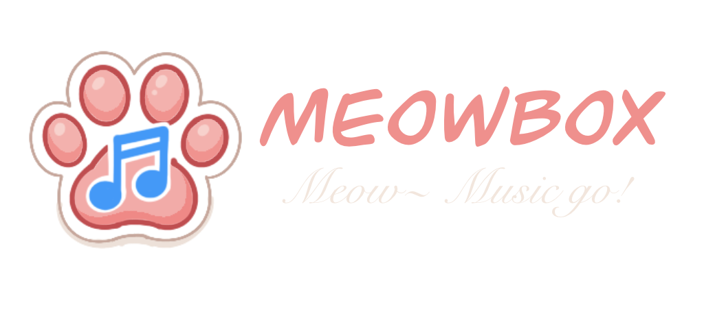

<h3>Meow~ Music Go !</h3>

 

# What is MeowBox?
MeowBox is a music streaming server that allows you to stream your favorite music to any device on the internet. It is built using Go programming language and can be easily deployed on any platform that supports Go.

## Features
- Play music from your server
- Music streaming for your embedded devices
- Music library management
- Music search and cache
- User authentication and authorization
- Music collection function

## Supported databases
- MySQL
- PostgreSQL